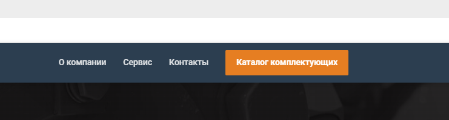
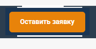
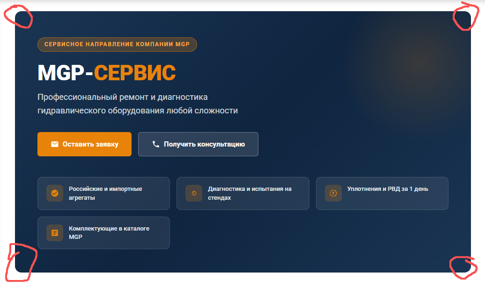
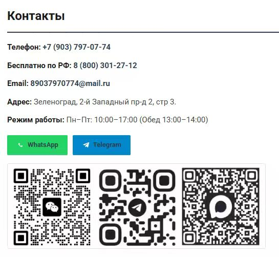
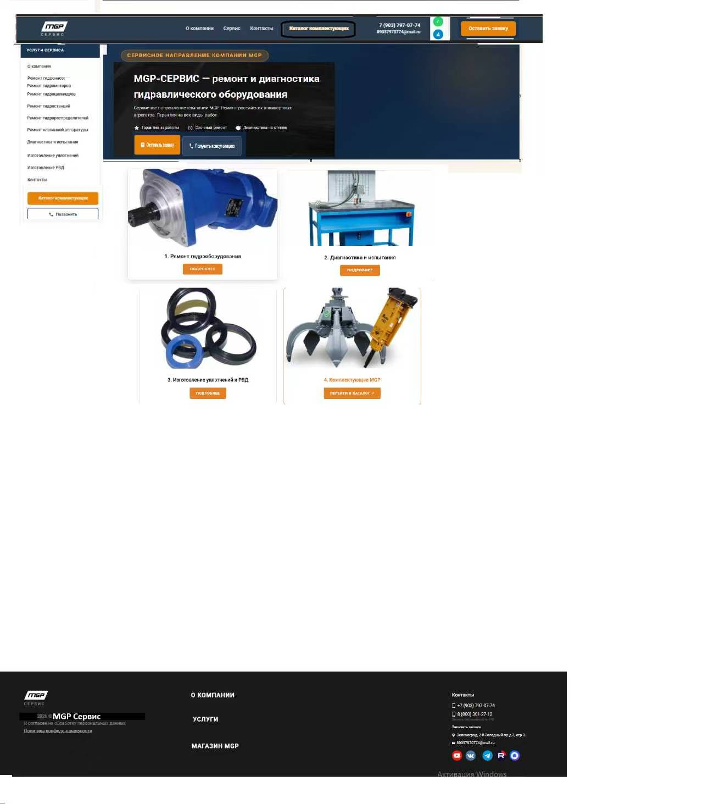
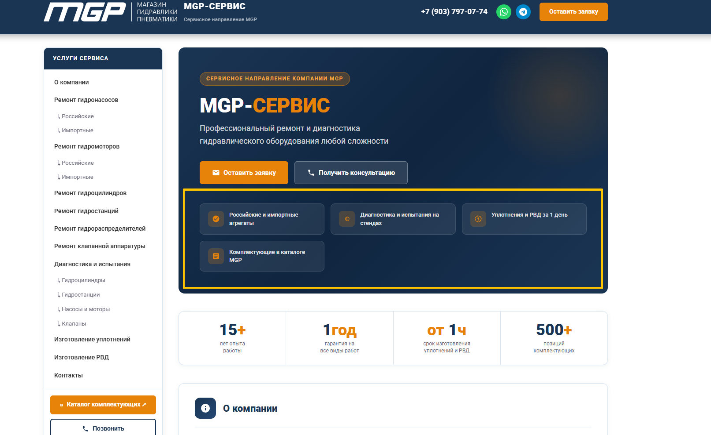

шапка должна быть такая

1. Каталог комплектующих должен быть фон такой же как и контакты, сервис, о компании, но и при наведении выделяться так же как и контакты, сервисы, о компании, пример прикрепляю

2. Месенджера поставить вертикально, как в примере, должны быть в строчке где и номера с почтой

3. Оставить заявку должна быть с закругленными углами примерно в этом месте

4. байнер новый

5. Необходимы закругленные края у банера как на первом варианте

6. 
Добавить активную кнопку МАКС

7. макет грубый)

8. все края кнопок баннеров должны закругленные как в примере

